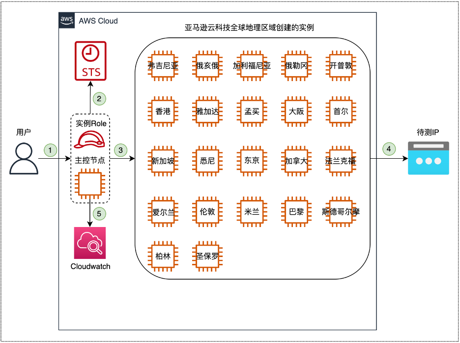
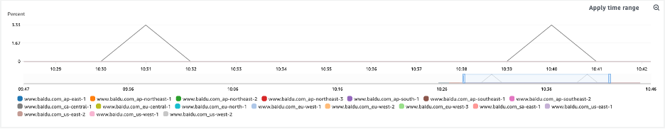
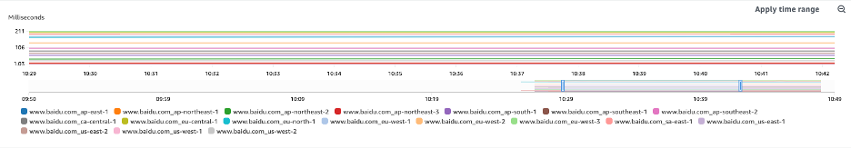
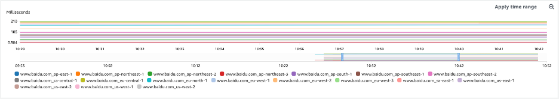
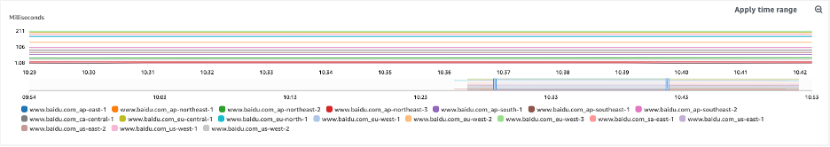
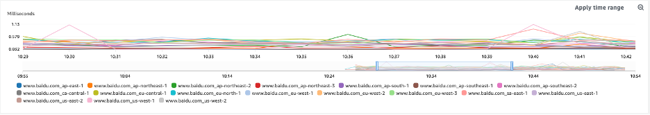

# 1.	背景介绍
众所周知，很多客户都有测试某个IP到亚马逊云科技各个Region时延的需求。常见的做法是让客户使用时延测试网站进行测试，比如AWS Ping Test (Latency) | Cloud Ping Test。这种测试网站的原理是从客户本地向亚马逊云科技的各个Region发送Ping包，然后将结果在网页上进行展示。
但是有些时候，客户所提供的IP并非是客户自己的IP，即无法使用这个IP Ping亚马逊云科技的各个Region，也就无法使用上边提到的方法进行测试。而这篇文章就是教您如何编写脚本满足这种场景的需求。

# 2. 实现思路
  
① 用户登陆主控节点：主控节点既可以是本地主机也可以是云上主机。本实验中，主控节点是亚马逊云科技首尔节点的一台EC2主机。  
② 主控节点验证相应权限  
a. 使用IAM Role在主控节点绑定如下三个权限  
•	AmazonEC2FullAccess: 可以操作所有EC2相关API  
•	CloudWatchFullAccess: 可以操作所有CloudWatch相关API  
•	AmazonSSMFullAccess: 可以操作所有SSM相关API  
b. 如果是使用本地主机作为主控节点，则需要在IAM中创建用户，绑定上述三个权限，再在本地主机中写入用户的AKSK以用作认证  
③ 主控节点并发在亚马逊全球地理区域创建EC2实例  
④ 从创建好的EC2实例中向待测IP进行Ping测试  
⑤ 主控节点将Ping测试数据上传到Cloudwatch做展示  

# 3. 结果展示
  
  
  
  
  
